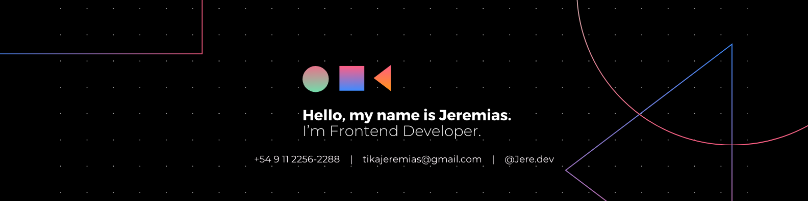

  
  

    I'm a Software Engineer. my passion is the design and create complete apps, Actively looking to expand my knowledge in Fullstack skills.
  

## About Me
- 💻 FullStack Developer
- 📖 Frontend Developer
- 🎨 UI Designer
  
## My Stack

 

 

 

 

 

 

<!--
**tikajeremias/tikajeremias** is a ✨ _special_ ✨ repository because its `README.md` (this file) appears on your GitHub profile.

Here are some ideas to get you started:

- 🔭 I’m currently working on ...
- 🌱 I’m currently learning ...
- 👯 I’m looking to collaborate on ...
- 🤔 I’m looking for help with ...
- 💬 Ask me about ...
- 📫 How to reach me: ...
- 😄 Pronouns: ...
- ⚡ Fun fact: ...
-->
